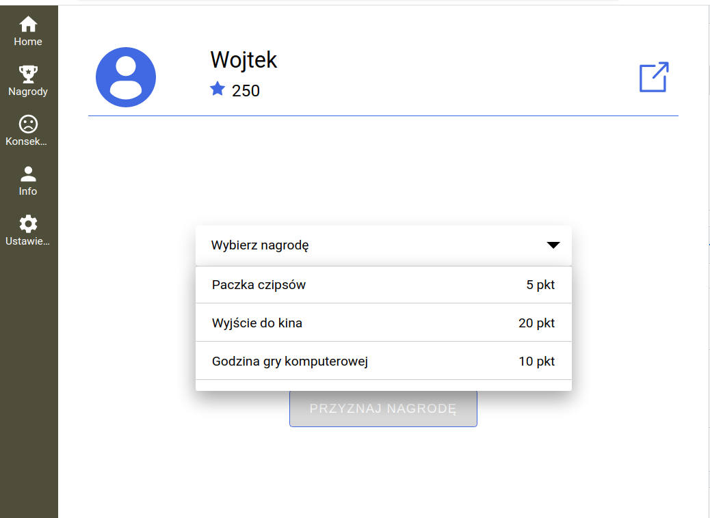
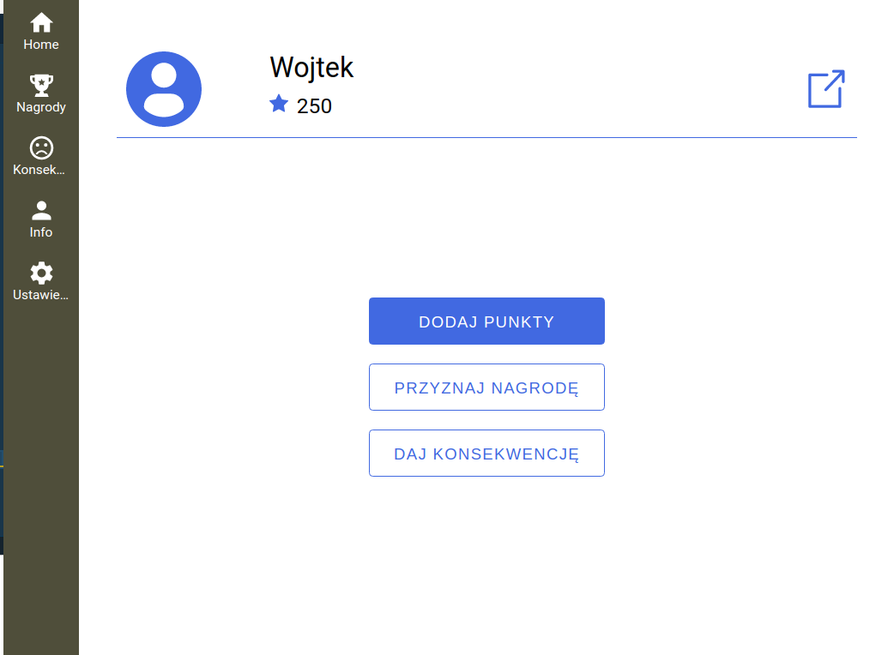
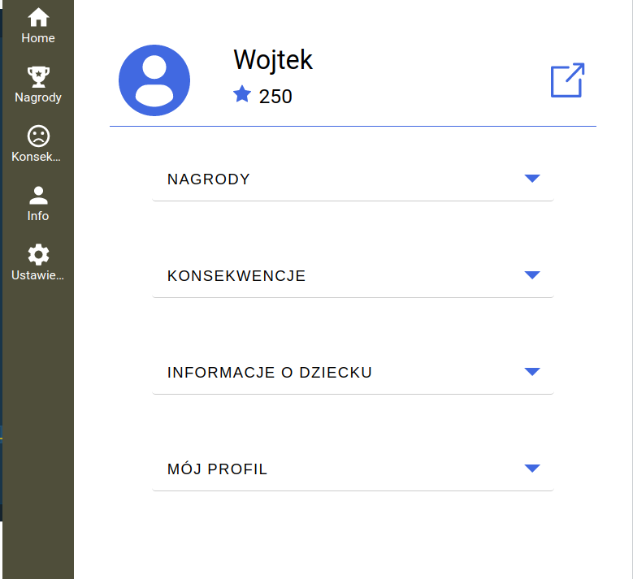
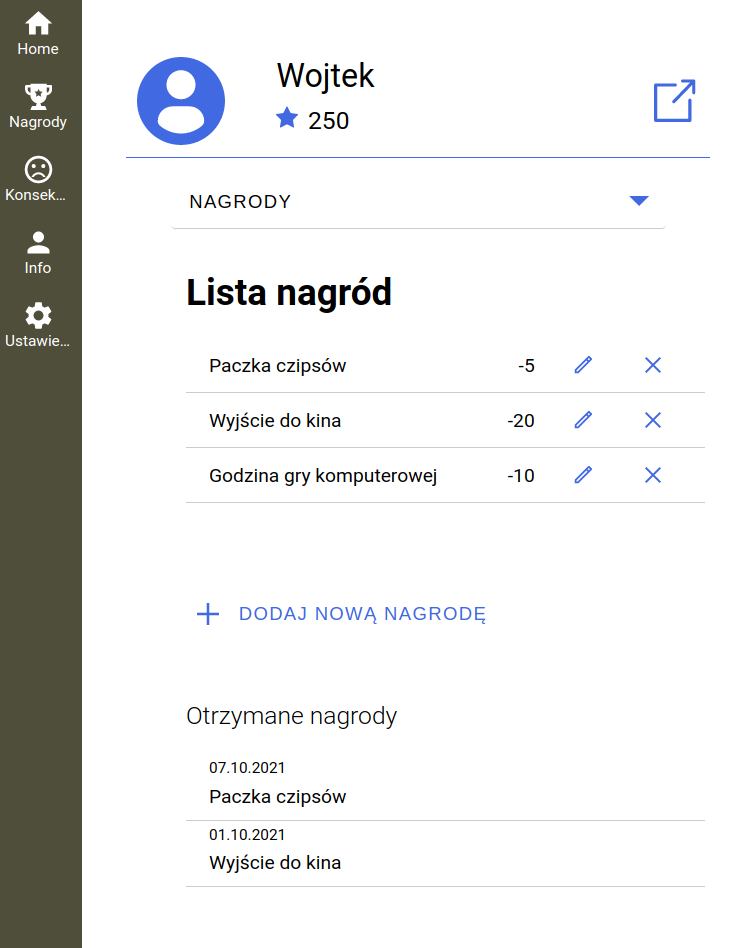
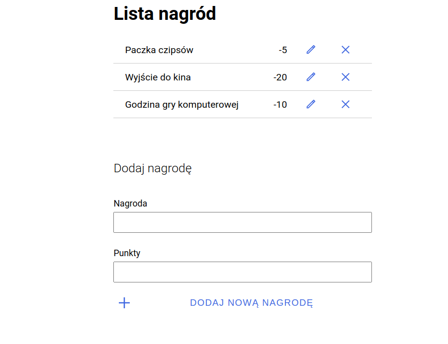
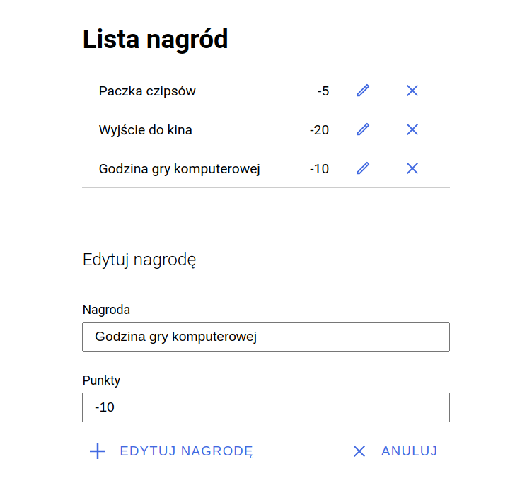
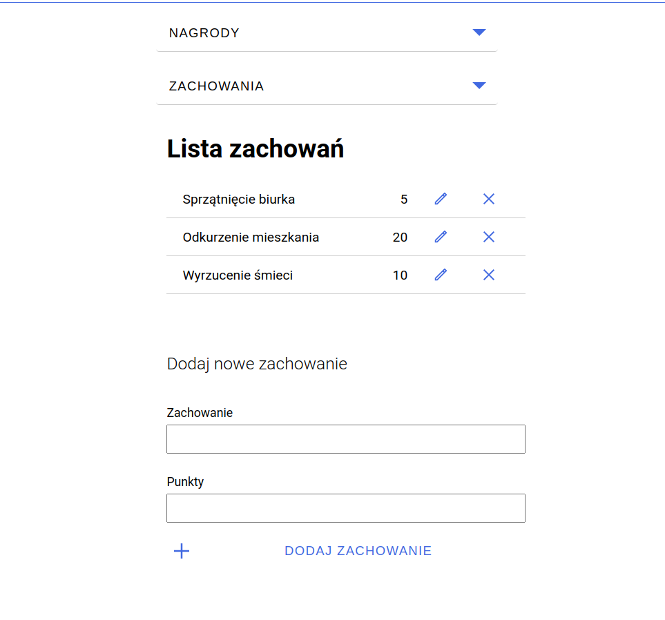
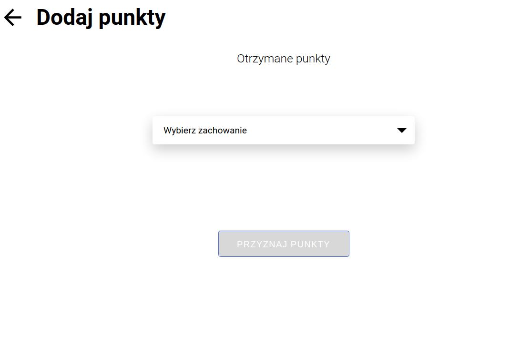
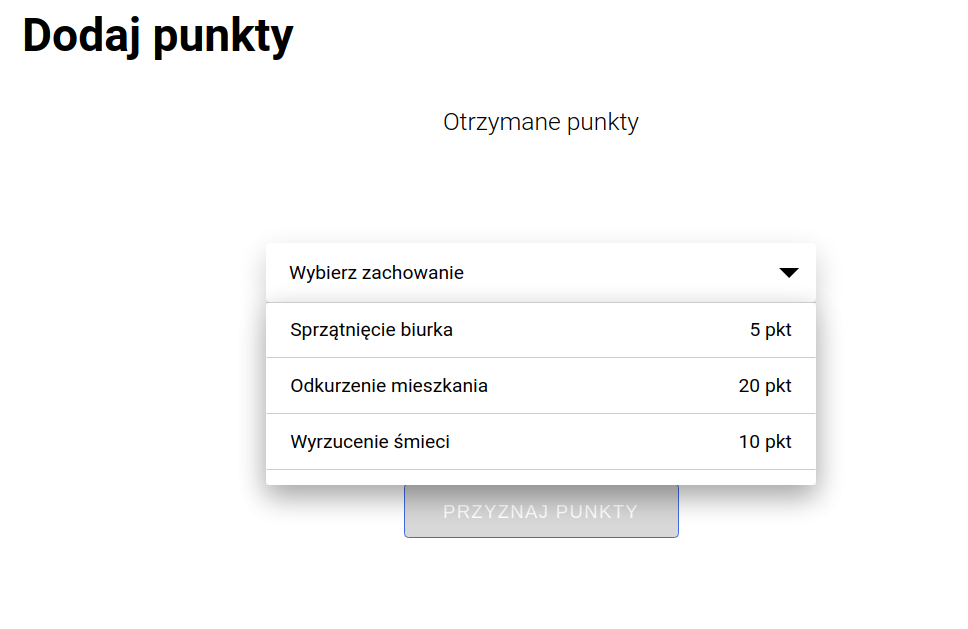
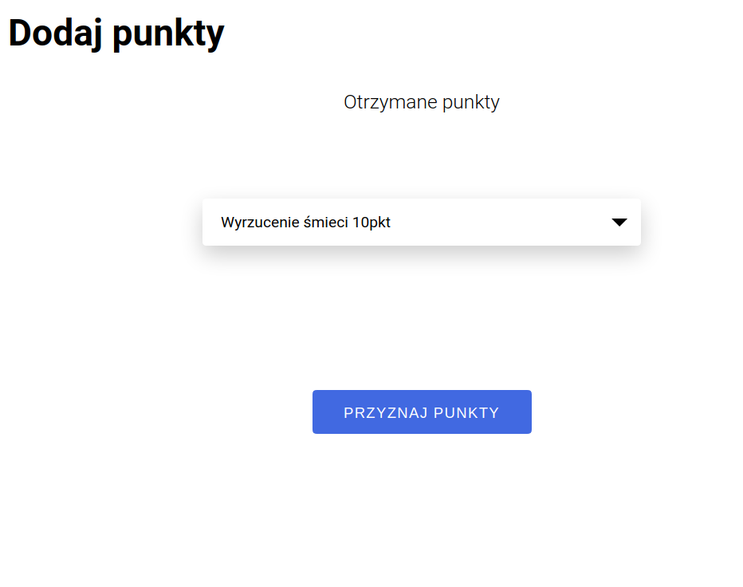

https://zetonteam.github.io/zeton_react/

# zeton_react

Zeton is an application that support behavioral therapy.
Token system for the child.
Allows you to earn points for your activities and exchange them for prizes.

## Application goals

- Developing deficit (desirable) behaviour
- Reduction of undesired behaviour
- Generating and maintaining therapy effects over time

## Development setup

This project was bootstrapped with [Vite](https://...todo).

## Setup node environment

To install dependencies, run:

### `npm install`

## Available Scripts

To list every command, run: `npm run`

In the project directory, you can run:

### `npm run dev`
or
### `npm start`
or
### `npm run start`

Runs the app in the development mode. 
Open [http://localhost:3000](http://localhost:3000) to view it in the browser.

The page will reload if you make edits. 
You will also see any lint errors in the console.

### `npm test`

Launches the test runner in the interactive watch mode. 
See the section about [running tests](https://facebook.github.io/create-react-app/docs/running-tests) for more information.

### `npm run build`

after that if we want to up in browser from dist:

### `npm run preview`

or if we want to get for that serve package:

### `npm run serve`

Builds the app for production to the `dist` folder. 
It correctly bundles React in production mode and optimizes the build for the best performance.

The build is minified and the filenames include the hashes. 
Your app is ready to be deployed!

See the section about [deployment](https://facebook.github.io/create-react-app/docs/deployment)-->[this is legacy for change!!! to Vite] for more information.

---
## Up Zeton_react app by Docker or Podman separated from zeton_full_stack option:

In cli like bash terminal, prompt one line of them below:
### `docker build -t react_vite_ts_image_start -f ./Dockerfile_18_vite_alpine_4`
### `podman build -t react_vite_ts_image_start -f ./Dockerfile_18_vite_alpine_4`

or one line of them below:
### `docker build -t react_vite_ts_image_start -f ./Dockerfile`
### `podman build -t react_vite_ts_image_start -f ./Dockerfile`

Next step in cli terminal one line of them below:
### `docker run -d -p 3000:3000 --name app_react_vite_ts_container_start react_vite_ts_image_start`
### `podman run -d -p 3000:3000 --name app_react_vite_ts_container_start react_vite_ts_image_start`

Next step in browser We can launch view of our frontend app without backend by endpoint below:
### `http://localhost:3000`

Another useful prompt in cli to check our images or containers situation:
### `docker images`
### `docker ps`

## Project UI

For styling we use [Styled Components](https://styled-components.com/)

Install the package of styled-components in your project directory with:

`npm install --save styled-components`

---

## Store container

For keeping state we use [Redux](https://redux.js.org/).

<!-- Install Redux Toolkit in your project directory with:

`npm install @reduxjs/toolkit` -->

Next install Redux core library:

`npm install redux`

And..

`npm install react-redux`

---

## Learn More
(We changed create-react-app to vite react by recomendations and because of vulnerabilities from "react-script" package)
# React + Vite

This template provides a minimal setup to get React working in Vite with HMR and some ESLint rules.

Currently, two official plugins are available:

- [@vitejs/plugin-react](https://github.com/vitejs/vite-plugin-react/blob/main/packages/plugin-react/README.md) uses [Babel](https://babeljs.io/) for Fast Refresh
- [@vitejs/plugin-react-swc](https://github.com/vitejs/vite-plugin-react-swc) uses [SWC](https://swc.rs/) for Fast Refresh

### Code Splitting

This section has moved here: ...todo

### Analyzing the Bundle Size

This section has moved here: ...todo

### Making a Progressive Web App

This section has moved here: ...todo

### Advanced Configuration

This section has moved here: ...todo

### Deployment

This section has moved here: ...todo

### `npm run build` fails to minify

This section has moved here: ...todo

### How it works

#### Prizes

1. Pick a prize:

There are two places to get to this mode.

- Click on the `Nagrody` button in the navbar. (After adding all pages it should work from every page)
- Or in Student's panel click on `Przyznaj nagrodę` button.

2. Prizes - edition mode

- Go to `Ustawienia` in the Navbar
  

- Click the first bar: `Nagrody`
  

- To add new prize fill in the form: `Dodaj nową nagrodę`
  

- To edit prize, click pen icon and fill the form below:
  

- To delete prize, click x icon

3. Tasks and points settings - click on Ustawienie in the sidebar (footer on mobile) and go to Zachowania
   

Here you can see all the tasks and points, add new ones, edit existing or delete them in the same way as it was shown in "Prizes" section.

4. Add points section - go to student's panel and choose `Dodaj punkty` button
   

- now you can see all the tasks and points that student can receive for completing the task by clicking `Wybierz zachowanie` on the select bar/button

  

- you can see a list of behaviours/tasks and points

  

- after selecting the task/behaviour you can click `Przyznaj punkty` button to add points for compliting the task.

  
